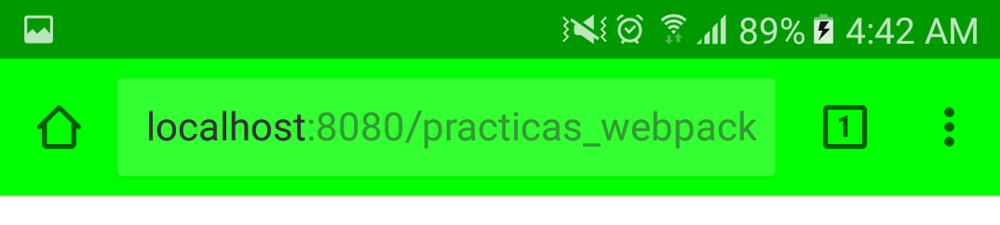

# Conceptos
### Significado de archivos .rc
Entre los significados podemos encontrar:
- runcom
- run commands
- resource control
- run control
- runtime configuration

# Visual Studio Code
### Configuración del entorno
* [Configuración](https://code.visualstudio.com/docs/getstarted/settings) - Configuración del espacio de trabajo.
### Utiliades para el entorno
* [Markdown Preview Enhanced](https://marketplace.visualstudio.com/items?itemName=shd101wyy.markdown-preview-enhanced) Permite visualizar la redacción del archivo .md (markdown) (ctrl + shift + m to show).
* [Apache Conf](https://marketplace.visualstudio.com/items?itemName=mrmlnc.vscode-apache) - Resalta la sintaxis de archivos de configuración de Apache como el .htaccess en código de Visual Studio.
* [Import Cost VSCode Extension](https://marketplace.visualstudio.com/items?itemName=wix.vscode-import-cost) - Calcula el tamaño de la importanción a un script
* [Path Intellisense](https://marketplace.visualstudio.com/items?itemName=christian-kohler.path-intellisense) - Autocompletado de nombres de archivos.
* [EditorConfig for VS Code](https://marketplace.visualstudio.com/items?itemName=EditorConfig.EditorConfig) - Ayuda a los desarrolladores a definir y mantener estilos de codigo consistentes entre diferentes editores e IDE's a través de un archivo .editorconfig

### Aspecto del editor
* [One Dark Pro](https://marketplace.visualstudio.com/items?itemName=zhuangtongfa.Material-theme) - Tema para el editor
* [seti-icons](https://marketplace.visualstudio.com/items?itemName=qinjia.seti-icons) - Tema de para los iconos


### Frontend
##### JavaScript
* [js-hint](https://marketplace.visualstudio.com/items?itemName=dbaeumer.jshint) Nota*: Necesita instalar jshint vía npm install -g jshint y un archivo .jshintrc
* [Sublime Babel](https://marketplace.visualstudio.com/items?itemName=joshpeng.sublime-babel-vscode) - Sintaxis de babel recomendada por [Babel para VSCode](https://babeljs.io/docs/editors).
* [BEM Expand for VS Code](https://marketplace.visualstudio.com/items?itemName=lukazakrajsek.bem-expand) Nota*: Pendiente aprender a usarlo
* [npm Intellisense](https://marketplace.visualstudio.com/items?itemName=christian-kohler.npm-intellisense) - Autocompleta modulos npm en sentencias import.
##### CSS
* [SCSS IntelliSense](https://marketplace.visualstudio.com/items?itemName=mrmlnc.vscode-scss) - Autocompletado para SASS y refactorización

### Backend
##### PHP
* [PHP DocBlocker](https://marketplace.visualstudio.com/items?itemName=neilbrayfield.php-docblocker) - Extensión para documentar código php (/**)
* [PHP Formatter](https://marketplace.visualstudio.com/items?itemName=Sophisticode.php-formatter) - Extensión para formatear código php
* [PHP IntelliSense](https://marketplace.visualstudio.com/items?itemName=felixfbecker.php-intellisense) - Autoacompletado y refactorización para PHP
* [PHP Intellisense - Crane](https://marketplace.visualstudio.com/items?itemName=HvyIndustries.crane) - Sugerencia de código
* [PHP intellisense for codeigniter](https://marketplace.visualstudio.com/items?itemName=small.php-ci) - Sugerencia de código para CodeIgniter
##### MySQL
* [mysql-inline-decorator](https://marketplace.visualstudio.com/items?itemName=odubuc.mysql-inline-decorator) - Añade resaltado a la sintaxis mysql


# Configuración para pruebas de PWA en chrome

* [Depuración remota](https://developers.google.com/web/tools/chrome-devtools/remote-debugging/) - Guía para activar la depuración remota en chrome
Si la depuración remota no se activa con el tutorial anterior se recomienda:
* Instalar [SDK Platform Tools](https://developer.android.com/studio/releases/platform-tools.html)
* Ejecutar comando ```adb.exe devices``` y asginar permiso en el dispositivo
Al ejecutar el comando se espara una respuesta similar a:
```
  List of devices attached
  ABCDEFG123  device
```
* Puede consultar información sobre [dispositivo no visible](https://stackoverflow.com/questions/29983673/cant-see-my-device-of-chrome-inspect-devices), se describe la solución al problema de un dispositivo no visible al querer usar la depuración remota

# Pruebas de la configuración remota

Configuración recomendada para chrome en el uso de la depuración remota:


Demo en chrome - vista smathphone:

Demo en smartphone - vista smathphone:


---
#### Por leer:
Revisar el uso de `file-loader` con `url-loader` testeando los mismos tipos de archivos (ejemplo: `/\.(png|.jpe?g)$/i`) ya que causa conflictos el url-loader al hacer el fallback al file-loader
* [URL loader](https://github.com/webpack-contrib/url-loader)
```
//Con el limite se tiene un tope antes de llamar al file-loader
{
  test: /\.(png|jpg|gif)$/i,
  use: [
    {
      loader: 'url-loader',
      options: {
        limit: 8192,
         name: "./assets/img/[name].[ext]",
         fallback: 'file-loader'
       }
     }
   ]
 },
```
* [File loader](https://github.com/webpack-contrib/file-loader)
* [Img loader](https://github.com/tcoopman/image-webpack-loader)

[Utileria para postcss](http://browserl.ist/?q=>+5%25%2Cie+>+10) - Permite ver el rango de navegadores soportados por medio de los parametros de browsers asginados al package.json

---
#### Extenciones para chrome:
`chrome://extensions/`

[AMP validator](https://chrome.google.com/webstore/detail/amp-validator/nmoffdblmcmgeicmolmhobpoocbbmknc?utm_source=chrome-app-launcher-info-dialog) - Validador para aplicaciones AMP
[Video speed controller](https://chrome.google.com/webstore/detail/video-speed-controller/nffaoalbilbmmfgbnbgppjihopabppdk) - Acelerador de velocidad de reproducción para videos
[Lightouse](https://chrome.google.com/webstore/detail/lighthouse/blipmdconlkpinefehnmjammfjpmpbjk) -Validador de PWA

Globals packages


npm install -g dotenv-extended
npm install -g webpack
npm install -g webpack-dev-server
npm install -g npm
npm install -g webpack-dashboard
